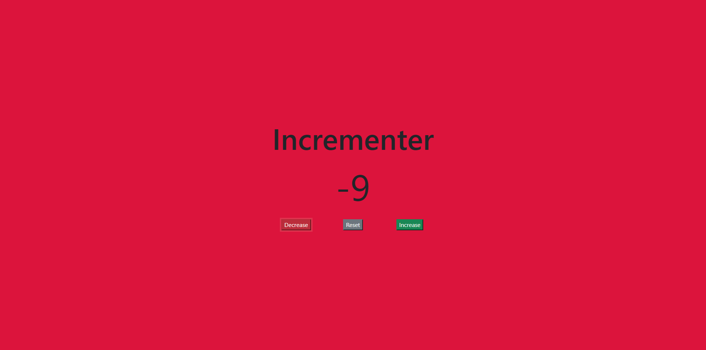

# Incrementer

## Description

This is a simple app that features a number counter along with a decrease, reset, and increase button. When the number is negative, the screen turns red. When the number is positive, the screen will turn green. This app was made for fun to practice the basics

## Table of Contents

- [Usage](#usage)
- [License](#license)
- [Questions](#questions)

## Usage

Clone the repository and open this folders root index.html file. This will launch the app in your web browser.

## License

This project is licensed under the MIT license. License link: https://opensource.org/license/mit/

## Questions

You can see below to reach me for any questions you have regarding the project.

https://github.com/rb2277

